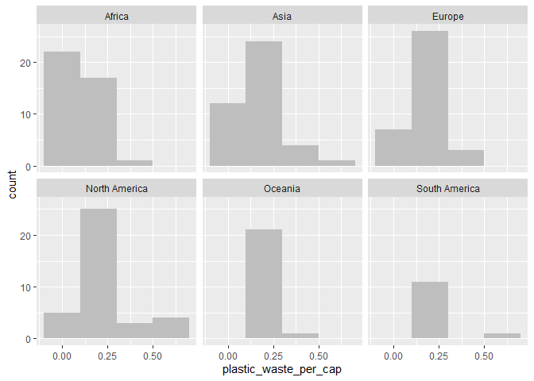
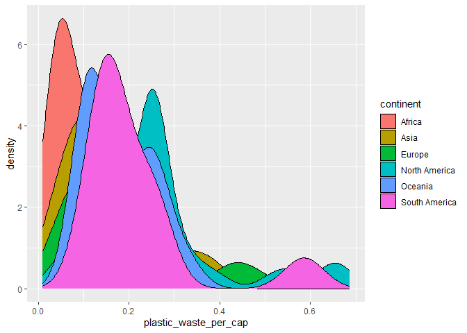
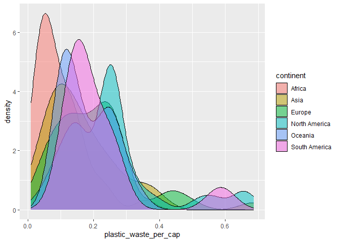

Lab 02 - Plastic waste
================
Jade Bety
16 septembre 2025

## Chargement des packages et des données

``` r
library(tidyverse) 
```

``` r
plastic_waste <- read_csv("data/plastic-waste.csv")
```

Commençons par filtrer les données pour retirer le point représenté par
Trinité et Tobago (TTO) qui est un outlier.

``` r
plastic_waste <- plastic_waste %>%
  filter(plastic_waste_per_cap < 3.5)
```

## Exercices

### Exercise 1

``` r
ggplot(plastic_waste, aes(x=plastic_waste_per_cap))+                                              geom_histogram(binwidth = 0.2, fill ="grey")+                                                   facet_wrap(~ continent)
```

<!-- -->

En Amérique du Nord et en Asie, la quantité de déchets par habitant est
plus dispersée, malgré le fait qu’il semble avoir une concentration de
données vers 0,25. Pour l’Afrique, sa consommation semble être moins
élevée que pour les autres continents. L’Océanie et l’Europe semblent
avoir des distributions semblables, mais l’Océanie a probablement moins
de pays parce que les barres sont plus basses. L’Amérique du Sud a une
majorité de valeurs plus basses vers 0,20, donc ce continent produit
moins de déchets plastiques que la plupart des continents.

### Exercise 2

``` r
ggplot(plastic_waste, aes(x=plastic_waste_per_cap))+                                              geom_density()
```

<!-- -->

``` r
ggplot(plastic_waste, aes(x = plastic_waste_per_cap, color = continent)) +
    geom_density()
```

<!-- -->

``` r
ggplot(plastic_waste, aes(x = plastic_waste_per_cap, fill = continent)) +
    geom_density()
```

<!-- -->

``` r
ggplot(plastic_waste, aes(x = plastic_waste_per_cap, fill = continent)) +   geom_density( alpha = 0.5)
```

<!-- -->

La couleur se trouve avec aes puisque cette dernière est du maping
(détermine une propriété en fonction d’une propriété des données) tandis
que la transparence est du setting (fixer une propriété), donc elle est
réglé dans geomdensity.

### Exercise 3

Boxplot:

``` r
# insert code here
```

Violin plot:

``` r
# insert code here
```

Réponse à la question…

### Exercise 4

``` r
# insert code here
```

Réponse à la question…

### Exercise 5

``` r
# insert code here
```

``` r
# insert code here
```

Réponse à la question…

## Conclusion

Recréez la visualisation:

``` r
# insert code here
```
