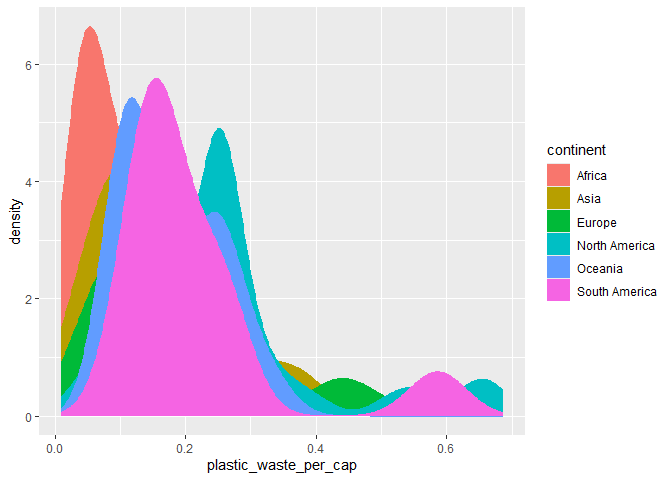
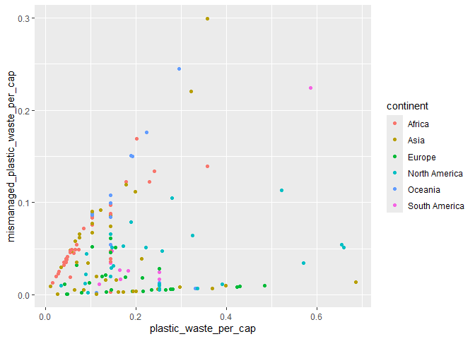

Lab 02 - Plastic waste
================
Jade Bety
16 septembre 2025

## Chargement des packages et des données

``` r
library(tidyverse) 
```

``` r
plastic_waste <- read_csv("data/plastic-waste.csv")
```

Commençons par filtrer les données pour retirer le point représenté par
Trinité et Tobago (TTO) qui est un outlier.

``` r
plastic_waste <- plastic_waste %>%
  filter(plastic_waste_per_cap < 3.5)
```

## Exercices

### Exercise 1

``` r
ggplot(plastic_waste, aes(x=plastic_waste_per_cap))+                                        geom_histogram(binwidth = 0.2, fill ="grey")+                                              facet_wrap(~ continent)
```

<!-- -->

En Amérique du Nord et en Asie, la quantité de déchets par habitant est
plus dispersée, malgré le fait qu’il semble avoir une concentration de
données vers 0,25. Pour l’Afrique, sa consommation semble être plus
faible par habitant que pour les autres continents. L’Océanie et
l’Europe semblent avoir des distributions semblables, mais l’Océanie a
probablement moins de pays parce que les barres sont plus basses.
L’Amérique du Sud a une majorité de valeurs plus basses vers 0,20, donc
ce continent produit moins de déchets plastiques que la plupart des
continents. Finalement, on peut conclure que l’Asie et l’Amérique du
Nord on les distributions les plus élevées tandis que l’Afrique a la
distribution la plus faible parmis les continents.

### Exercise 2

``` r
ggplot(plastic_waste, aes(x=plastic_waste_per_cap))+                                              geom_density()
```

<!-- -->

``` r
ggplot(plastic_waste, aes(x = plastic_waste_per_cap, color = continent)) +
    geom_density()
```

<!-- -->

``` r
ggplot(plastic_waste, aes(x = plastic_waste_per_cap, fill = continent, color = continent)) +
    geom_density()
```

<!-- -->

``` r
ggplot(plastic_waste, aes(x = plastic_waste_per_cap, fill = continent, color = continent )) +   geom_density( alpha = 0.5)
```

<!-- -->

La couleur se trouve avec aes puisque cette dernière est du mapping
(détermine une propriété en fonction d’une propriété des données) tandis
que la transparence est du setting (fixer une propriété), donc elle est
réglé dans geomdensity.

### Exercise 3

Boxplot:

``` r
ggplot(plastic_waste, aes(x= continent, y = plastic_waste_per_cap)) +
      geom_boxplot()
```

<!-- -->

Violin plot:

``` r
ggplot(plastic_waste, aes(x= continent, y = plastic_waste_per_cap)) +
    geom_violin()
```

<!-- -->

Les violin plots permettent de visualiser la distrubution de données,
comme les box plots, mais permettent aussi de visualiser la forme de
cette distribution et de visualiser la densité. En d’autres termes, les
violins plots nous permettent d’analyser la forme de la distribution et
les box plots sont efficaces pour une analyse plus rapide ou pour voir
les valeurs extrêmes.

### Exercise 4

``` r
ggplot(plastic_waste, aes(x= plastic_waste_per_cap, y = mismanaged_plastic_waste_per_cap, color = continent )) +
 geom_point()
```

<!-- -->

La relation entre ces deux variables est généralement linéaire ce qui
signifie que plus qu’un pays produit de déchets plastiques, plus qu’il a
tendance à moins bien le gérer. L’Europe et l’Amérique du Nord diverge
de cette tendance puisqu’ils semblent bien gérer leur quantité de
déchets malgré le fait qu’ils en génèrent beaucoup. D’un autre côté,
c’est l’inverse pour l’Asie et l’Afrique qui ont plus de difficulté à
les gérer même s’ils en produisent moins.

### Exercise 5

``` r
ggplot(plastic_waste, aes(x= plastic_waste_per_cap, y =total_pop )) +
   geom_point()
```

    ## Warning: Removed 10 rows containing missing values or values outside the scale range
    ## (`geom_point()`).

<!-- -->

``` r
ggplot(plastic_waste, aes(x= plastic_waste_per_cap, y =coastal_pop )) +
 geom_point()
```

<!-- -->

Les deux graphiques se ressemblent beaucoup. Il semble avoir plus de
personnes qui habitent sur les côtes qui produisent moins, mais
autrement, il n’y a pas de relation plus forte que l’autre.

## Conclusion

Recréez la visualisation:

``` r
plastic_waste_coastal <- plastic_waste %>% 
  mutate(coastal_pop_prop = coastal_pop / total_pop) %>%
  filter(plastic_waste_per_cap < 3)

ggplot(plastic_waste_coastal, aes(x = coastal_pop_prop, y = plastic_waste_per_cap, color = continent)) +
       geom_point() +                                                                                   geom_smooth(method = "lm", se = TRUE, color = "black") +
         labs(
                title = "Quantité de déchets plastiques vs Proportion de la population  côtière",
                 subtitle = "Selon le continent",
                  x = "Proportion de la population côtière (Coastal / total population)",
               y = "Nombre de déchets plastiques par habitant",
                color = "Continent")
```

    ## `geom_smooth()` using formula = 'y ~ x'

    ## Warning: Removed 10 rows containing non-finite outside the scale range
    ## (`stat_smooth()`).

    ## Warning: Removed 10 rows containing missing values or values outside the scale range
    ## (`geom_point()`).

<!-- -->
